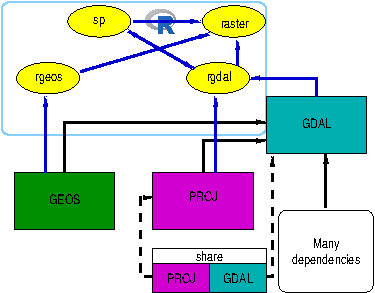
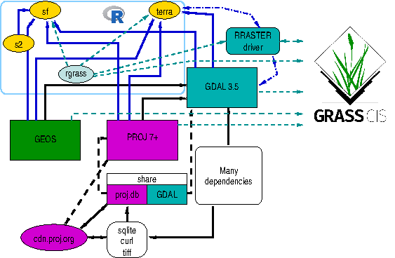

# Coercion between object formats

## Introduction

The original R-GRASS interface (Bivand 2000; Neteler and Mitasova 2008)
was designed to move raster and later vector data between R and GRASS
GIS. To do this, use was made of intermediate files, often using the
external GDAL library on both sides. On the R side, the **rgdal** now
archived package was used, interfacing GDAL and PROJ as GRASS GIS also
did. The GRASS commands `r.in.gdal`, `r.out.gdal`, `v.in.ogr` and
`v.out.ogr` were matched by **rgdal** functions using the same
underlying external libraries:



GDAL was supplemented for raster data by simply reading and writing
uncompressed binary files using `r.in.bin` and `r.out.bin`, with custom
functions on the R side. As then written, the R-GRASS interface used
**sp** classes for both raster and vector data, supplemented more
recently with **sf** classes for vector data only.

The current version of the R-GRASS interface has been simplified to use
the **terra** package because it, like **sf** and **rgdal** before it,
links to the important external libraries. The workhorse driver is known
as `RRASTER`, and has been widely used in **raster** and **terra** (see
also (<https://rspatial.org>)). It uses GDAL but writes a flat
uncompressed binary file. Using
[`terra::rast()`](https://rspatial.github.io/terra/reference/rast.html)
also appears to preserve category names and colour tables, but needs
further testing (see (<https://github.com/osgeo/rgrass/issues/42>)).



From GDAL 3.5.0, the `RRASTER` driver also supports WKT2_2019 CRS
representations; in earlier versions of GDAL, the driver only supported
the proj-string representation
(<https://github.com/osgeo/rgrass/issues/51>).

These changes mean that users transferring data between R and GRASS will
need to coerce between **terra** classes `SpatVector` and `SpatRaster`
and the class system of choice. In addition, `SpatRaster` is only read
into memory from file when this is required, so requiring some care.

## Loading and attaching packages

This vignette is constructed conditioning on the availability of
aforementioned R packages, i.e. if some were missing at the time of
package building, some code blocks will not be displayed.

On loading and attaching, **terra** displays its version:

``` r

library("terra")
```

    ## terra 1.9.46

``` r

library("sf")
```

    ## Linking to GEOS 3.10.2, GDAL 3.4.1, PROJ 8.2.1; sf_use_s2() is TRUE

``` r

library("sp")
```

``` r

library("stars")
```

    ## Loading required package: abind

``` r

library("raster")
```

[`terra::gdal()`](https://rspatial.github.io/terra/reference/gdal.html)
tells us the versions of the external libraries being used by **terra**:

``` r

gdal(lib = "all")
```

    ##    gdal  proj   geos   TBB
    ## 1 3.4.1 8.2.1 3.10.2 FALSE

When using CRAN binary packages built static for Windows and macOS, the
R packages will use the same versions of the external libraries, but not
necessarily the same versions as those against which GRASS was
installed.

## `"SpatVector"` coercion

In the **terra** package (Hijmans 2022b), vector data are held in
`"SpatVector"` objects. This means that when
[`read_VECT()`](https://osgeo.github.io/rgrass/reference/read_VECT.md)
is used, a `"SpatVector"` object is returned, and the same class of
object is needed for
[`write_VECT()`](https://osgeo.github.io/rgrass/reference/read_VECT.md)
for writing to GRASS.

``` r

fv <- system.file("ex/lux.shp", package = "terra")
(v <- vect(fv))
```

    ## class       : SpatVector
    ## geometry    : polygons
    ## dimensions  : 12, 6  (geometries, attributes)
    ## extent      : 5.74414, 6.528252, 49.44781, 50.18162  (xmin, xmax, ymin, ymax)
    ## source      : lux.shp
    ## coord. ref. : lon/lat WGS 84 (EPSG:4326)
    ## names       :  ID_1   NAME_1  ID_2   NAME_2  AREA   POP
    ## type        : <num>    <chr> <num>    <chr> <num> <num>
    ## values      :     1 Diekirch     1 Clervaux   312 18081
    ##                   1 Diekirch     2 Diekirch   218 32543
    ##                   1 Diekirch     3  Redange   259 18664
    ##               ...

These objects are always held in memory, so there is no
[`inMemory()`](https://rspatial.github.io/terra/reference/sources.html)
method:

``` r

try(inMemory(v))
```

    ## Error : unable to find an inherited method for function 'inMemory' for signature 'x = "SpatVector"'

The coordinate reference system is expressed in WKT2-2019 form:

``` r

cat(crs(v), "\n")
```

    ## GEOGCRS["WGS 84",
    ##     DATUM["World Geodetic System 1984",
    ##         ELLIPSOID["WGS 84",6378137,298.257223563,
    ##             LENGTHUNIT["metre",1]]],
    ##     PRIMEM["Greenwich",0,
    ##         ANGLEUNIT["degree",0.0174532925199433]],
    ##     CS[ellipsoidal,2],
    ##         AXIS["geodetic latitude (Lat)",north,
    ##             ORDER[1],
    ##             ANGLEUNIT["degree",0.0174532925199433]],
    ##         AXIS["geodetic longitude (Lon)",east,
    ##             ORDER[2],
    ##             ANGLEUNIT["degree",0.0174532925199433]],
    ##     ID["EPSG",4326]]

### `"sf"`

Most new work should use vector classes defined in the **sf** package
(Pebesma 2022, 2018). In this case, coercion uses
[`st_as_sf()`](https://r-spatial.github.io/sf/reference/st_as_sf.html):

``` r

v_sf <- st_as_sf(v)
v_sf
```

    ## Simple feature collection with 12 features and 6 fields
    ## Geometry type: POLYGON
    ## Dimension:     XY
    ## Bounding box:  xmin: 5.74414 ymin: 49.44781 xmax: 6.528252 ymax: 50.18162
    ## Geodetic CRS:  WGS 84
    ## First 10 features:
    ##    ID_1       NAME_1 ID_2           NAME_2 AREA    POP
    ## 1     1     Diekirch    1         Clervaux  312  18081
    ## 2     1     Diekirch    2         Diekirch  218  32543
    ## 3     1     Diekirch    3          Redange  259  18664
    ## 4     1     Diekirch    4          Vianden   76   5163
    ## 5     1     Diekirch    5            Wiltz  263  16735
    ## 6     2 Grevenmacher    6       Echternach  188  18899
    ## 7     2 Grevenmacher    7           Remich  129  22366
    ## 8     2 Grevenmacher   12     Grevenmacher  210  29828
    ## 9     3   Luxembourg    8         Capellen  185  48187
    ## 10    3   Luxembourg    9 Esch-sur-Alzette  251 176820
    ##                          geometry
    ## 1  POLYGON ((6.026519 50.17767...
    ## 2  POLYGON ((6.178368 49.87682...
    ## 3  POLYGON ((5.881378 49.87015...
    ## 4  POLYGON ((6.131309 49.97256...
    ## 5  POLYGON ((5.977929 50.02602...
    ## 6  POLYGON ((6.385532 49.83703...
    ## 7  POLYGON ((6.316665 49.62337...
    ## 8  POLYGON ((6.425158 49.73164...
    ## 9  POLYGON ((5.998312 49.69992...
    ## 10 POLYGON ((6.039474 49.44826...

and the [`vect()`](https://rspatial.github.io/terra/reference/vect.html)
method to get from **sf** to **terra**:

``` r

v_sf_rt <- vect(v_sf)
v_sf_rt
```

    ## class       : SpatVector
    ## geometry    : polygons
    ## dimensions  : 12, 6  (geometries, attributes)
    ## extent      : 5.74414, 6.528252, 49.44781, 50.18162  (xmin, xmax, ymin, ymax)
    ## coord. ref. : lon/lat WGS 84 (EPSG:4326)
    ## names       :  ID_1   NAME_1  ID_2   NAME_2  AREA   POP
    ## type        : <num>    <chr> <num>    <chr> <num> <num>
    ## values      :     1 Diekirch     1 Clervaux   312 18081
    ##                   1 Diekirch     2 Diekirch   218 32543
    ##                   1 Diekirch     3  Redange   259 18664
    ##               ...

``` r

all.equal(v_sf_rt, v, check.attributes = FALSE)
```

    ## [1] TRUE

### `"Spatial"`

To coerce to and from vector classes defined in the **sp** package
(Bivand et al. 2013), methods in **raster** are used as an intermediate
step:

``` r

v_sp <- as(v, "Spatial")
print(summary(v_sp))
```

    ## Object of class SpatialPolygonsDataFrame
    ## Coordinates:
    ##        min       max
    ## x  5.74414  6.528252
    ## y 49.44781 50.181622
    ## Is projected: FALSE 
    ## proj4string : [+proj=longlat +datum=WGS84 +no_defs]
    ## Data attributes:
    ##       ID_1             NAME_1        ID_2             NAME_2        AREA      
    ##  Min.   :1.000   Length   :12   Min.   : 1.00   Length   :12   Min.   : 76.0  
    ##  1st Qu.:1.000   N.unique : 3   1st Qu.: 3.75   N.unique :12   1st Qu.:187.2  
    ##  Median :2.000   N.blank  : 0   Median : 6.50   N.blank  : 0   Median :225.5  
    ##  Mean   :1.917   Min.nchar: 8   Mean   : 6.50   Min.nchar: 5   Mean   :213.4  
    ##  3rd Qu.:3.000   Max.nchar:12   3rd Qu.: 9.25   Max.nchar:16   3rd Qu.:253.0  
    ##  Max.   :3.000                  Max.   :12.00                  Max.   :312.0  
    ##       POP        
    ##  Min.   :  5163  
    ##  1st Qu.: 18518  
    ##  Median : 26097  
    ##  Mean   : 50167  
    ##  3rd Qu.: 36454  
    ##  Max.   :182607

``` r

v_sp_rt <- vect(st_as_sf(v_sp))
all.equal(v_sp_rt, v, check.attributes = FALSE)
```

    ## different crs

    ## [1] FALSE

## `"SpatRaster"` coercion

In the **terra** package, raster data are held in `"SpatRaster"`
objects. This means that when
[`read_RAST()`](https://osgeo.github.io/rgrass/reference/read_RAST.md)
is used, a `"SpatRaster"` object is returned, and the same class of
object is needed for
[`write_RAST()`](https://osgeo.github.io/rgrass/reference/read_RAST.md)
for writing to GRASS.

``` r

fr <- system.file("ex/elev.tif", package = "terra")
(r <- rast(fr))
```

    ## class       : SpatRaster
    ## size        : 90, 95, 1  (nrow, ncol, nlyr)
    ## resolution  : 0.008333333, 0.008333333  (x, y)
    ## extent      : 5.741667, 6.533333, 49.44167, 50.19167  (xmin, xmax, ymin, ymax)
    ## coord. ref. : lon/lat WGS 84 (EPSG:4326)
    ## source      : elev.tif
    ## name        : elevation
    ## min value   :       141
    ## max value   :       547

In general, `"SpatRaster"` objects are files, rather than data held in
memory:

``` r

try(inMemory(r))
```

    ## [1] FALSE

### `"stars"`

The **stars** package (Pebesma 2021) uses GDAL through **sf**. A
coercion method is provided from `"SpatRaster"` to `"stars"`:

``` r

r_stars <- st_as_stars(r)
print(r_stars)
```

    ## stars object with 2 dimensions and 1 attribute
    ## attribute(s):
    ##           Min. 1st Qu. Median     Mean 3rd Qu. Max.  NAs
    ## elev.tif   141     291    333 348.3366     406  547 3942
    ## dimension(s):
    ##   from to offset     delta refsys point x/y
    ## x    1 95  5.742  0.008333 WGS 84 FALSE [x]
    ## y    1 90  50.19 -0.008333 WGS 84 FALSE [y]

which round-trips in memory.

``` r

(r_stars_rt <- rast(r_stars))
```

    ## class       : SpatRaster
    ## size        : 90, 95, 1  (nrow, ncol, nlyr)
    ## resolution  : 0.008333333, 0.008333333  (x, y)
    ## extent      : 5.741667, 6.533333, 49.44167, 50.19167  (xmin, xmax, ymin, ymax)
    ## coord. ref. : lon/lat WGS 84 (EPSG:4326)
    ## source(s)   : memory
    ## name        : elev.tif
    ## min value   :      141
    ## max value   :      547

When coercing to `"stars_proxy"` the same applies:

``` r

(r_stars_p <- st_as_stars(r, proxy = TRUE))
```

    ## stars_proxy object with 1 attribute in 1 file(s):
    ## $elev.tif
    ## [1] "[...]/elev.tif"
    ## 
    ## dimension(s):
    ##   from to offset     delta refsys point x/y
    ## x    1 95  5.742  0.008333 WGS 84 FALSE [x]
    ## y    1 90  50.19 -0.008333 WGS 84 FALSE [y]

with coercion from `"stars_proxy"` also not reading data into memory:

``` r

(r_stars_p_rt <- rast(r_stars_p))
```

    ## class       : SpatRaster
    ## size        : 90, 95, 1  (nrow, ncol, nlyr)
    ## resolution  : 0.008333333, 0.008333333  (x, y)
    ## extent      : 5.741667, 6.533333, 49.44167, 50.19167  (xmin, xmax, ymin, ymax)
    ## coord. ref. : lon/lat WGS 84 (EPSG:4326)
    ## source      : elev.tif
    ## name        : elevation
    ## min value   :       141
    ## max value   :       547

### `"RasterLayer"`

From version 3.6-3 the **raster** package (Hijmans 2022a) uses **terra**
for all GDAL operations. Because of this, coercing a `"SpatRaster"`
object to a `"RasterLayer"` object is simple:

``` r

(r_RL <- raster(r))
```

    ## class      : RasterLayer 
    ## dimensions : 90, 95, 8550  (nrow, ncol, ncell)
    ## resolution : 0.008333333, 0.008333333  (x, y)
    ## extent     : 5.741667, 6.533333, 49.44167, 50.19167  (xmin, xmax, ymin, ymax)
    ## crs        : +proj=longlat +datum=WGS84 +no_defs 
    ## source     : elev.tif 
    ## names      : elevation 
    ## values     : 141, 547  (min, max)

``` r

inMemory(r_RL)
```

    ## [1] FALSE

The WKT2-2019 CRS representation is present but not shown by default:

``` r

cat(wkt(r_RL), "\n")
```

    ## GEOGCRS["unknown",
    ##     DATUM["World Geodetic System 1984",
    ##         ELLIPSOID["WGS 84",6378137,298.257223563,
    ##             LENGTHUNIT["metre",1]],
    ##         ID["EPSG",6326]],
    ##     PRIMEM["Greenwich",0,
    ##         ANGLEUNIT["degree",0.0174532925199433],
    ##         ID["EPSG",8901]],
    ##     CS[ellipsoidal,2],
    ##         AXIS["longitude",east,
    ##             ORDER[1],
    ##             ANGLEUNIT["degree",0.0174532925199433,
    ##                 ID["EPSG",9122]]],
    ##         AXIS["latitude",north,
    ##             ORDER[2],
    ##             ANGLEUNIT["degree",0.0174532925199433,
    ##                 ID["EPSG",9122]]]]

This object (held on file rather than in memory) can be round-tripped:

``` r

(r_RL_rt <- rast(r_RL))
```

    ## class       : SpatRaster
    ## size        : 90, 95, 1  (nrow, ncol, nlyr)
    ## resolution  : 0.008333333, 0.008333333  (x, y)
    ## extent      : 5.741667, 6.533333, 49.44167, 50.19167  (xmin, xmax, ymin, ymax)
    ## coord. ref. : +proj=longlat +datum=WGS84 +no_defs
    ## source      : elev.tif
    ## name        : elevation
    ## min value   :       141
    ## max value   :       547

### `"Spatial"`

`"RasterLayer"` objects can be used for coercion from a `"SpatRaster"`
object to a `"SpatialGridDataFrame"` object:

``` r

r_sp_RL <- as(r_RL, "SpatialGridDataFrame")
summary(r_sp_RL)
```

    ## Object of class SpatialGridDataFrame
    ## Coordinates:
    ##          min       max
    ## s1  5.741667  6.533333
    ## s2 49.441667 50.191667
    ## Is projected: FALSE 
    ## proj4string : [+proj=longlat +datum=WGS84 +no_defs]
    ## Grid attributes:
    ##    cellcentre.offset    cellsize cells.dim
    ## s1          5.745833 0.008333333        95
    ## s2         49.445833 0.008333333        90
    ## Data attributes:
    ##    elevation    
    ##  Min.   :141.0  
    ##  1st Qu.:291.0  
    ##  Median :333.0  
    ##  Mean   :348.3  
    ##  3rd Qu.:406.0  
    ##  Max.   :547.0  
    ##  NAs    :3942

The WKT2-2019 CRS representation is present but not shown by default:

``` r

cat(wkt(r_sp_RL), "\n")
```

    ## GEOGCRS["unknown",
    ##     DATUM["World Geodetic System 1984",
    ##         ELLIPSOID["WGS 84",6378137,298.257223563,
    ##             LENGTHUNIT["metre",1]],
    ##         ID["EPSG",6326]],
    ##     PRIMEM["Greenwich",0,
    ##         ANGLEUNIT["degree",0.0174532925199433],
    ##         ID["EPSG",8901]],
    ##     CS[ellipsoidal,2],
    ##         AXIS["longitude",east,
    ##             ORDER[1],
    ##             ANGLEUNIT["degree",0.0174532925199433,
    ##                 ID["EPSG",9122]]],
    ##         AXIS["latitude",north,
    ##             ORDER[2],
    ##             ANGLEUNIT["degree",0.0174532925199433,
    ##                 ID["EPSG",9122]]]]

This object can be round-tripped, but use of **raster** forefronts the
Proj.4 string CRS representation:

``` r

(r_sp_RL_rt <- raster(r_sp_RL))
```

    ## class      : RasterLayer 
    ## dimensions : 90, 95, 8550  (nrow, ncol, ncell)
    ## resolution : 0.008333333, 0.008333333  (x, y)
    ## extent     : 5.741667, 6.533333, 49.44167, 50.19167  (xmin, xmax, ymin, ymax)
    ## crs        : +proj=longlat +datum=WGS84 +no_defs 
    ## source     : memory
    ## names      : elevation 
    ## values     : 141, 547  (min, max)

``` r

cat(wkt(r_sp_RL_rt), "\n")
```

    ## GEOGCRS["unknown",
    ##     DATUM["World Geodetic System 1984",
    ##         ELLIPSOID["WGS 84",6378137,298.257223563,
    ##             LENGTHUNIT["metre",1]],
    ##         ID["EPSG",6326]],
    ##     PRIMEM["Greenwich",0,
    ##         ANGLEUNIT["degree",0.0174532925199433],
    ##         ID["EPSG",8901]],
    ##     CS[ellipsoidal,2],
    ##         AXIS["longitude",east,
    ##             ORDER[1],
    ##             ANGLEUNIT["degree",0.0174532925199433,
    ##                 ID["EPSG",9122]]],
    ##         AXIS["latitude",north,
    ##             ORDER[2],
    ##             ANGLEUNIT["degree",0.0174532925199433,
    ##                 ID["EPSG",9122]]]]

``` r

(r_sp_rt <- rast(r_sp_RL_rt))
```

    ## class       : SpatRaster
    ## size        : 90, 95, 1  (nrow, ncol, nlyr)
    ## resolution  : 0.008333333, 0.008333333  (x, y)
    ## extent      : 5.741667, 6.533333, 49.44167, 50.19167  (xmin, xmax, ymin, ymax)
    ## coord. ref. : +proj=longlat +datum=WGS84 +no_defs
    ## source(s)   : memory
    ## name        : elevation
    ## min value   :       141
    ## max value   :       547

``` r

crs(r_sp_RL_rt)
```

    ## Coordinate Reference System:
    ## Deprecated Proj.4 representation: +proj=longlat +datum=WGS84 +no_defs 
    ## WKT2 2019 representation:
    ## GEOGCRS["unknown",
    ##     DATUM["World Geodetic System 1984",
    ##         ELLIPSOID["WGS 84",6378137,298.257223563,
    ##             LENGTHUNIT["metre",1]],
    ##         ID["EPSG",6326]],
    ##     PRIMEM["Greenwich",0,
    ##         ANGLEUNIT["degree",0.0174532925199433],
    ##         ID["EPSG",8901]],
    ##     CS[ellipsoidal,2],
    ##         AXIS["longitude",east,
    ##             ORDER[1],
    ##             ANGLEUNIT["degree",0.0174532925199433,
    ##                 ID["EPSG",9122]]],
    ##         AXIS["latitude",north,
    ##             ORDER[2],
    ##             ANGLEUNIT["degree",0.0174532925199433,
    ##                 ID["EPSG",9122]]]]

Coercion to the **sp** `"SpatialGridDataFrame"` representation is also
provided by **stars**:

``` r

r_sp_stars <- as(r_stars, "Spatial")
summary(r_sp_stars)
```

    ## Object of class SpatialGridDataFrame
    ## Coordinates:
    ##         min       max
    ## x  5.741667  6.533333
    ## y 49.441667 50.191667
    ## Is projected: FALSE 
    ## proj4string : [+proj=longlat +datum=WGS84 +no_defs]
    ## Grid attributes:
    ##   cellcentre.offset    cellsize cells.dim
    ## x          5.745833 0.008333333        95
    ## y         49.445833 0.008333333        90
    ## Data attributes:
    ##     elev.tif    
    ##  Min.   :141.0  
    ##  1st Qu.:291.0  
    ##  Median :333.0  
    ##  Mean   :348.3  
    ##  3rd Qu.:406.0  
    ##  Max.   :547.0  
    ##  NAs    :3942

``` r

cat(wkt(r_sp_stars), "\n")
```

    ## GEOGCRS["WGS 84",
    ##     DATUM["World Geodetic System 1984",
    ##         ELLIPSOID["WGS 84",6378137,298.257223563,
    ##             LENGTHUNIT["metre",1]]],
    ##     PRIMEM["Greenwich",0,
    ##         ANGLEUNIT["degree",0.0174532925199433]],
    ##     CS[ellipsoidal,2],
    ##         AXIS["geodetic latitude (Lat)",north,
    ##             ORDER[1],
    ##             ANGLEUNIT["degree",0.0174532925199433]],
    ##         AXIS["geodetic longitude (Lon)",east,
    ##             ORDER[2],
    ##             ANGLEUNIT["degree",0.0174532925199433]],
    ##     ID["EPSG",4326]]

and can be round-tripped:

``` r

(r_sp_stars_rt <- rast(st_as_stars(r_sp_stars)))
```

    ## class       : SpatRaster
    ## size        : 90, 95, 1  (nrow, ncol, nlyr)
    ## resolution  : 0.008333333, 0.008333333  (x, y)
    ## extent      : 5.741667, 6.533333, 49.44167, 50.19167  (xmin, xmax, ymin, ymax)
    ## coord. ref. : lon/lat WGS 84 (EPSG:4326)
    ## source(s)   : memory
    ## name        : elev.tif
    ## min value   :      141
    ## max value   :      547

\`\`

``` r

cat(crs(r_sp_rt), "\n")
```

    ## GEOGCRS["unknown",
    ##     DATUM["World Geodetic System 1984",
    ##         ELLIPSOID["WGS 84",6378137,298.257223563,
    ##             LENGTHUNIT["metre",1]],
    ##         ID["EPSG",6326]],
    ##     PRIMEM["Greenwich",0,
    ##         ANGLEUNIT["degree",0.0174532925199433],
    ##         ID["EPSG",8901]],
    ##     CS[ellipsoidal,2],
    ##         AXIS["longitude",east,
    ##             ORDER[1],
    ##             ANGLEUNIT["degree",0.0174532925199433,
    ##                 ID["EPSG",9122]]],
    ##         AXIS["latitude",north,
    ##             ORDER[2],
    ##             ANGLEUNIT["degree",0.0174532925199433,
    ##                 ID["EPSG",9122]]]]

## References

Bivand, R. S. 2000. “Using the R Statistical Data Analysis Language on
GRASS 5.0 GIS Data Base Files.” *Computers and Geosciences* 26: 1043–52.

Bivand, Roger S., Edzer Pebesma, and Virgilio Gomez-Rubio. 2013.
*Applied Spatial Data Analysis with R, Second Edition*. Springer, NY.
<https://asdar-book.org/>.

Hijmans, Robert J. 2022a. *raster: Geographic Data Analysis and
Modeling*. <https://cran.r-project.org/package=raster>.

Hijmans, Robert J. 2022b. *terra: Spatial Data Analysis*.
<https://cran.r-project.org/package=terra>.

Neteler, M., and H. Mitasova. 2008. *Open Source GIS: A GRASS GIS
Approach, Third Edition*. Springer.

Pebesma, Edzer. 2018. “Simple Features for R: Standardized Support for
Spatial Vector Data.” *The R Journal* 10 (1): 439–46.
<https://doi.org/10.32614/RJ-2018-009>.

Pebesma, Edzer. 2021. *stars: Spatiotemporal Arrays, Raster and Vector
Data Cubes*. <https://CRAN.R-project.org/package=stars>.

Pebesma, Edzer. 2022. *sf: Simple Features for R*.
<https://cran.r-project.org/package=sf>.
